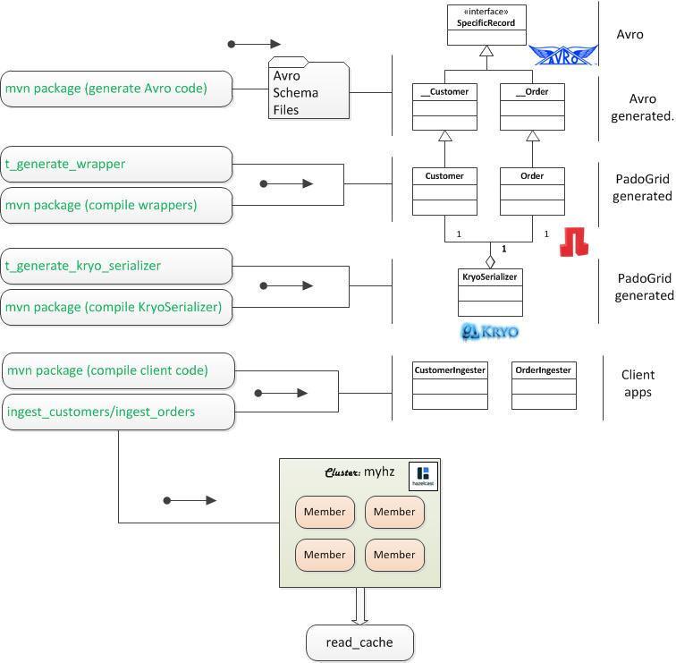

 [*PadoGrid*](https://github.com/padogrid) | [*Catalogs*](https://github.com/padogrid/catalog-bundles/blob/master/all-catalog.md) | [*Manual*](https://github.com/padogrid/padogrid/wiki) | [*FAQ*](https://github.com/padogrid/padogrid/wiki/faq) | [*Releases*](https://github.com/padogrid/padogrid/releases) | [*Templates*](https://github.com/padogrid/padogrid/wiki/Using-Bundle-Templates) | [*Pods*](https://github.com/padogrid/padogrid/wiki/Understanding-Padogrid-Pods) | [*Kubernetes*](https://github.com/padogrid/padogrid/wiki/Kubernetes) | [*Docker*](https://github.com/padogrid/padogrid/wiki/Docker) | [*Apps*](https://github.com/padogrid/padogrid/wiki/Apps) | [*Quick Start*](https://github.com/padogrid/padogrid/wiki/Quick-Start)

---
# Hazelcast Kryo/Avro Code Generator

This bundle provides step-by-step instructions for generating and deploying Avro and `KryoSerializer` in Hazelcast. Using PadoGrid's code generator, you can on the fly generate and deploy Avro wrapper classes and the correspoinding Kryo serializer.

## Installing Bundle

```bash
install_bundle -download bundle-hazelcast-4n5-app-kryo_codegen
```

## Use Case

Kryo allows you to ingest POJO objects to Hazelcast without addding any Hazelcast dependencies. In this bundle, we introduce PadoGrid's code generator that generates `KryoSerializer` required by Hazelcast for registering custom serializers. To register POJO classes in Hazelcast, you must register each POJO class individually, making the Hazelcast configuration process difficult and error prone. PadoGrid's Kryo code generator simplifies the registration process by generating the `KryoSerializer` class that automatically groups all the POJO classes in a given package. Instead of registering each POJO class individually, you would just register `KryoSerializer`. 

The Kryo code generator also includes a wrapper class generator which extends POJO classes to allow you to override class methods as needed. This is particularly useful if you generate domain classes using IDL-based serialization tools such as Avro. Avro creates a compact binary data format and is ideal for storing POJO objects in Hazelcast. Avro, however, only supports primitive types and leaves the chore of marshalling and unmarshalling non-primitive types to the application. To close this gap, the wrapper class generator is provided to generate wrapper classes in which you can add your custom marshalling and unmarshalling code without affecting the Avro-generated code.

For example, Avro does not support the `Date` class. To store a `Date` object, you would need to store its `long` value, i.e., `Date.getTime()` as the `long` type and the `logicalType` of `timestamp-millis` as follows.

```json
{
 "fields": [

     {"name": "orderDateLong", "type": "long", "logicalType": "timestamp-millis"}

 ]
}
```

To get the `Date` object back, the application must explicitly create a `Date` object, i.e., `new Date(long)`. With the wrapper class, this can be done by adding a method that returns the `Date` object. For example,

```java
public class Order extends org.hazelcast.demo.nw.data.avro.generated.__Order {
	public Order() {
		super();
	}

	public void setOrderDate(Date date) {
		super.setOrderDateLong(date.getTime());
	}

	public Date getOrderDate() {
		return new Date(super.getOrderDateLong());
	}
...
}
```



## Required Software

- PadoGrid 0.9.5-SNAPSHOT+ (02/16/2021)
- Maven 3.x

## Runng This Bundle

First, make sure you are switched into a Hazelcast cluster. You can create the default cluster by executing the following.

```bash
# Hazelcast cluster - creates 'myhz' cluster
make_cluster -product hazelcast
switch_cluster myhz
```

If you want to quickly test the bundle, you can execute the following and jump to [Step 9](#9-configure-hazelcast-configuration-file-hazelcastxml-with-the-kryoserializer-class). The `build_app` carries out the setps 1 to 8 in sequence. It is recommended, however, that you go through the entire steps to get familiar with the code generation and deployment process.

```bash
cd_app kryo_codegen; cd bin_sh
./build_app
```

If you have a schema registry running, then you can use the `-registry` option to retrieve the schemas instead. Please see the usage by running the following.

```bash
./build_app -?
```

### 1. Place Avro schema files in the `src/main/resources` directory.

This bundle includes the following example schema files.

```bash
cd_app kryo_codegen
mkdir -p src/main/resources
cp etc/avro/* src/main/resources/
tree src/main
```

**Output:**

```console
src/main
└── resources
    ├── category.avsc
    ├── customer.avsc
    ├── employee.avsc
    └── order.avsc
```

Note that we do not have any Java code in the source directory. We start with a set of only Avro schema files and end up with all the necessary Java code for ingesting data into Hazelcast. The following shows the `customer.asvc` schema file contents.

**`customer.asvc`:**

```json
{
"namespace": "org.hazelcast.demo.nw.data.avro.generated",
 "type": "record",
 "name": "__Order",
 "fields": [
     {"name": "orderId", "type": "string"},
     {"name": "customerId", "type": "string"},
     {"name": "employeeId", "type": "string"},
     {"name": "orderDateLong", "type": "long", "logicalType": "timestamp-millis"},
     {"name": "requiredDateLong", "type": "long", "logicalType": "timestamp-millis"},
     {"name": "shippedDateLong", "type": "long", "logicalType": "timestamp-millis"},
     {"name": "shipVia", "type": "string"},
     {"name": "freight", "type": "double"},
     {"name": "shipName", "type": "string"},
     {"name": "shipAddress", "type": "string"},
     {"name": "shipCity", "type": "string"},
     {"name": "shipRegion", "type": ["string", "null"]},
     {"name": "shipPostalCode", "type": "string"},
     {"name": "shipCountry", "type": "string"}
 ]
}

```

### 2. Generate Avro classes using the Avro schema files.

```bash
mvn package
```

The above Maven command generates the corresponding Java classes as follows.

```console
src/main
├── java
│   └── org
│       └── hazelcast
│           └── demo
│               └── nw
│                   └── data
│                       └── avro
│                           └── generated
│                               ├── __Category.java
│                               ├── __Customer.java
│                               ├── __Employee.java
│                               └── __Order.java
└── resources
    ├── category.avsc
    ├── customer.avsc
    ├── employee.avsc
    └── order.avsc
```

### 3. Generate Avro wrapper classes. 

Run the PadoGrid's `t_generate_wrappers` command to generate the wrapper classes that extend the generated Avro classes. You can use the Avro classes that were generated in the previous setp as they are but it is recommended that you generate the wrapper classes so that you can override the Avro class methods as needed. Let's generate wrapper classes by executing the following:

```bash
t_generate_wrappers -sp org.hazelcast.demo.nw.data.avro.generated \
   -tp org.hazelcast.demo.nw.data.avro \
   -dir src/main/java \
   -jar lib/app-kryo-codegen-hazelcast-4-1.0.0.jar \
   -classpath lib
```

The above command creates the wrapper classes in the `org.hazelcast.demo.nw.data.avro` package as follows.

```console
src/main
├── java
│   └── org
│       └── hazelcast
│           └── demo
│               └── nw
│                   └── data
│                       └── avro
│                           ├── Category.java
│                           ├── Customer.java
│                           ├── Employee.java
│                           ├── Order.java
│                           └── generated
│                               ├── __Category.java
│                               ├── __Customer.java
│                               ├── __Employee.java
│                               └── __Order.java
└── resources
    ├── category.avsc
    ├── customer.avsc
    ├── employee.avsc
    └── order.avsc
```

### 4. Compile the wrapper classes and create a jar file.

The generated wrapper classes need to be compiled and packaged into a jar file. Run Maven again to generate the `lib/app-kryo-codegen-hazelcast-4-1.0.0.jar` file that includes the wrapper classes.

```bash
mvn package
```

### 5. Generate KryoSerializer for the generated wrapper classes.

With the wrapper classes in the jar file, we can now generate the `KyroSerializer` class that properly registers all the wrapper classes in Hazelcast. Execute the following command to generate `KryoSerializer`.

```bash
t_generate_kryo_serializer -id 1200 \
   -package org.hazelcast.demo.nw.data.avro \
   -dir src/main/java \
   -jar lib/app-kryo-codegen-hazelcast-4-1.0.0.jar \
   -classpath lib
```

**Output:**

The above command outputs the following (Note the registration information. We'll be entering the ouputted serializer settings in the Hazelcast configuration file later.)

```console
  New class count: 4
Total class count: 4
[0] org.hazelcast.demo.nw.data.avro.Category
[1] org.hazelcast.demo.nw.data.avro.Customer
[2] org.hazelcast.demo.nw.data.avro.Employee
[3] org.hazelcast.demo.nw.data.avro.Order
KryoSerializer generated:
   C:\Users\dpark\Work\git\padogrid-bundles\hazelcast-bundles\bundle-hazelcast-4-app-kryo_codegen\src\main\java\org\hazel
cast\demo\nw\data\avro\KryoSerializer.java

To register KryoSerializer, add the following lines in the Hazelcast configuration file.
    <serialization>
        <serializers>
             <global-serializer override-java-serialization="true">
                 org.hazelcast.demo.nw.data.avro.KryoSerializer
             </global-serializer>
        </serializers>
    </serialization>

```

The source directory now has `KryoSerializer.java` as shown below.


```console
src/main
├── java
│   └── org
│       └── hazelcast
│           └── demo
│               └── nw
│                   └── data
│                       └── avro
│                           ├── Category.java
│                           ├── Customer.java
│                           ├── Employee.java
│                           ├── KryoSerializer.java
│                           ├── Order.java
│                           └── generated
│                               ├── __Category.java
│                               ├── __Customer.java
│                               ├── __Employee.java
│                               └── __Order.java
└── resources
    ├── category.avsc
    ├── customer.avsc
    ├── employee.avsc
    └── order.avsc
```

### 6. Compile the generated `KryoSerializer`.

Once again, repackage the `lib/app-kryo-codegen-hazelcast-4-1.0.0.jar` file by running Maven. At this time, the jar file also includes the generated classes including `KryoSerializer` which we need to register with Hazelcast.

```bash
mvn package
```

### 7. Build client apps.

This bundle includes data ingestion clients that use the generated wrapper classes to ingest data into Hazelcast. The source code is located in the `src_provided` directory. Let's copy it to the `src` directory and rebuild the jar file.

```bash
# Copy client code
cp -r src_provided/* src/

# Rebuild
mvn package
```

:information_source: Take a look at `src_provided/org/apache/geode/demo/nw/data/avro/Order.java`. It extends the Avro generated class `__Order` to include Date objects.

### 8. Build and deploy a distribution tarball.

The  `lib/app-kryo-codegen-hazelcast-4-1.0.0.jar` is now ready to be deployed to the Hazelcast cluster. Since we are using Kryo and Avro, we also need to deploy their jar files along with all the dependencies. The previous Maven build step also generated a tarball, `app-kryo-codegen-hazelcast-4-1.0.0.tar.gz`, that contains all the jar files. We need to untar the tarball in the workspace's `plugins` directory so that the jar files can be picked up by all the apps and clusters running in the same workspace.

```bash
# Deploy the generated tarball in the workspace plugins directory.
tar -C $PADOGRID_WORKSPACE/plugins/ -xzf target/assembly/app-kryo-codegen-hazelcast-4-1.0.0.tar.gz
```

:information_source: Note that you would also need to deploy the tarball to external apps that connect to your Hazelcast cluster. For example, to deploy it to Kafka Connect, untar it in the connector's plugin directory.

### 9. Configure Hazelcast configuration file (`hazelcast.xml`) with the `KryoSerializer` class.

Place the serialization information in the current cluster's Hazelcast configuration file.

```bash
# Create a Hazelcast cluster if you have not done so already
make_cluster -product hazelcast -cluster myhz

# Switch into your Hazelcast cluster and edit hazelcast.xml
switch_cluster myhz
vi etc/hazelcast.xml
```

Copy the serializer configuration output from Step 5 and enter it in the `hazelcast.xml` file as follows.  

```xml
<hazelcast>
...
       <serialization>
             <serializers>
                  <global-serializer override-java-serialization="true">
                  org.hazelcast.demo.nw.data.avro.KryoSerializer
                  </global-serializer>
             </serializers>
        </serialization>
...
</hazelcast>
```

### 10. Start your cluster.

```bash
start_cluster
```

### 11. Ingest data.

The scripts for running the client code are in the `bin_sh` directory. The ingestion scripts use the `etc/hazelcast-client.xml` file which already includes the `KyroSerializer` class. Let's execute them.

```bash
# Change dir to the app's bin_sh to run 'ingest' scripts
cd_app kryo_codegen/bin_sh

# Ingest data into the 'nw/customers' map.
./ingest_customers

# Ingest data into the 'nw/orders' map.
./ingest_orders
```

**`ingest_customers` Output:**

```
Data Class: org.hazelcast.demo.nw.data.avro.Customer
  Ingested: 100
       Map: nw/customers
```

**`ingest_orders` Output:**

```
Data Class: org.hazelcast.demo.nw.data.avro.Order
  Ingested: 100
       Map: nw/orders
```

If you dont' see the outputs shown above then check the log files in the `log/` directory.

### 12. Read ingested data.

You can use the `read_cache` script to read the ingested data as follows. We have ingested data into the 'nw/customers' and 'nw/orders' maps.

```bash
./read_cache nw/customers
./read_cache nw/orders
```

## Executing Code Generator Programmatically 

You can also execute the code generators programmatically. The source code of `MyWrapperGenerator` and `MyKryoGenerator` is located in the `src_provided/main/java` directory and shown below.

###  WapperGenerator

```java
package org.hazelcast.addon.demo.kryo;

import com.netcrest.padogrid.tools.WrapperGenerator;

/**
 * This class shows you how to run WrapperGenerator programmatically.
 *
 * @author dpark
 *
 */
public class MyWrapperGenerator {

	public static void main(String[] args) throws Exception {

		// All paths are relative to the working directory.
		String sp = "org.hazelcast.demo.nw.data.avro.generated";
		String tp = " org.hazelcast.demo.nw.data.avro";
		String dir = "src/main/java";
		String jar = "lib/app-kryo-codegen-hazelcast-4-1.0.0.jar";
		boolean overwrite = false;

		WrapperGenerator generator = new WrapperGenerator(sp, tp, jar, dir, WrapperGenerator.WrapperType.simple, overwrite);
		generator.generateWrappers();
	}
}
```

### HazelcastKryoGenerator

```java
package org.hazelcast.addon.demo.kryo;

import com.netcrest.padogrid.tools.HazelcastKryoGenerator;

/**
 * This class shows you how to run HazelcastKryoGenerator programmatically.
 *
 * @author dpark
 *
 */
public class MyKryoGenerator {

	public static void main(String[] args) throws Exception {

		// All paths are relative to the working directory.
		String packageName = " org.hazelcast.demo.nw.data.avro";
		String jarPath = "lib/app-kryo-codegen-hazelcast-4-1.0.0.jar";
		int typeId = 1200;
		String srcDir = "src/main/java";

		HazelcastKryoGenerator generator = new HazelcastKryoGenerator(packageName, jarPath, typeId, srcDir);
		generator.generateKryoSerializer();
	}
}
```

## Teardown

```bash
stop_cluster
```

---

 [*PadoGrid*](https://github.com/padogrid) | [*Catalogs*](https://github.com/padogrid/catalog-bundles/blob/master/all-catalog.md) | [*Manual*](https://github.com/padogrid/padogrid/wiki) | [*FAQ*](https://github.com/padogrid/padogrid/wiki/faq) | [*Releases*](https://github.com/padogrid/padogrid/releases) | [*Templates*](https://github.com/padogrid/padogrid/wiki/Using-Bundle-Templates) | [*Pods*](https://github.com/padogrid/padogrid/wiki/Understanding-Padogrid-Pods) | [*Kubernetes*](https://github.com/padogrid/padogrid/wiki/Kubernetes) | [*Docker*](https://github.com/padogrid/padogrid/wiki/Docker) | [*Apps*](https://github.com/padogrid/padogrid/wiki/Apps) | [*Quick Start*](https://github.com/padogrid/padogrid/wiki/Quick-Start)
